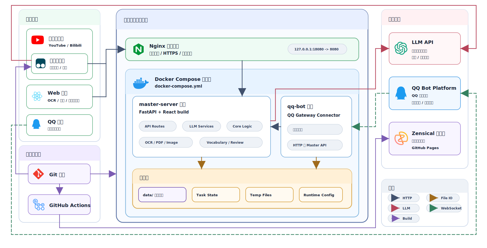

---
search:
  exclude: true
icon: lucide/rocket
---

# Linkualog 快速入口

Linkualog 是一个面向英语学习的个人词汇工作流：从图片、PDF、视频字幕或聊天入口收集素材，经 OCR / LLM 辅助整理后，保存为可复习、可维护、可生成静态站的 JSON 词条。

当前最推荐先跑起来的是 `master-server`。它包含后端 API 和主前端，能完成上传、解析、生词本维护、精修与复习。

## 架构概览



## 先跑起来

### 本地运行

适合开发机或个人电脑。建议环境：Python `3.13`、`uv`、Node.js `20`、`npm`。本地处理 PDF 时还需要 `poppler-utils`。

```bash
cd /path/to/linkualog
cp .env.example .env
# 编辑 .env，至少填入 MASTER_SERVER_LLM_API_KEY

cd master-server
uv sync
uv run main.py
```

默认地址：

- 主前端：`http://localhost:8000`
- 后端 API：`http://localhost:8080`

### Docker 运行

适合服务器、NAS 或小主机。

```bash
cd /path/to/linkualog
cp .env.example .env
# 编辑 .env，至少填入 MASTER_SERVER_LLM_API_KEY

docker compose up -d --build master-server
```

默认地址：

- 主前端：`http://服务器IP/`
- 后端 API：`http://服务器IP:8080/`

常用命令：

```bash
docker compose logs -f master-server
docker compose restart master-server
docker compose up -d --build master-server
```

## 怎么使用

1. 打开主前端，在“全局配置”里确认模型和默认生词本目录。
2. 在 `OCR 解析库` 上传图片或 PDF，让系统提取词条和上下文。
3. 在 `我的生词本` 查看已保存的 JSON 词条。
4. 在 `精修与复习` 进行合并建议、释义修正和复习打分。
5. 需要静态展示时，用 `static-website` 把 `data/` 转成网站。

如果你想从 YouTube 字幕收集词条，安装 `browser-plugin/user/linkualog.user.js`，并把插件里的 `LAN Sync URL` 指向：

```text
http://<你的主机>:8080/api/vocabulary/add
```

如果你需要 QQ 入口，先在 `.env` 中填写 `QQ_APP_ID` 和 `QQ_APP_SECRET`，再运行：

```bash
./deploy.sh
```

## 数据在哪里

核心数据放在仓库根目录的 `data/`：

```text
data/
  daily/*.json
  cet/*.json
  ielts/*.json
```

每个 JSON 通常对应一个单词或短语，包含释义、例句、来源、复习记录等信息。`master-server` 直接读写这些文件；静态站会从这些 JSON 生成 Markdown 页面。

当前内置分类：

- `daily`
- `cet`
- `ielts`

如果新增分类，页面可以生成，但 `static-website/zensical.toml` 的导航需要手动补上。

## 生成静态站

静态站只是展示层，不负责长期运行服务。它会读取 `DATA_DIR` 下的 JSON，生成 `docs/dictionary/`，再由 Zensical 构建网站。

```bash
cd static-website
uv sync
make serve
```

默认参数：

- `PORT=6789`
- `DATA_DIR=../data`

常用命令：

```bash
make data                         # 只生成 docs/dictionary/
make serve PORT=6789 DATA_DIR=../data
make build DATA_DIR=../data       # 输出到 static-website/site/
make clean
```

部署时通常只需要把 `static-website/site/` 交给 Nginx、Caddy、对象存储或 GitHub Pages。

## 模块速览

| 路径 | 作用 |
| --- | --- |
| `master-server/` | FastAPI 后端和 React 主前端 |
| `browser-plugin/user/` | 给最终用户安装的油猴脚本 |
| `browser-plugin/dev/` | 浏览器插件开发工程 |
| `qq-bot/` | 可选 QQ 机器人 connector |
| `static-website/` | Zensical 静态网站 |
| `data/` | 默认词条数据库 |

更多细节优先看：

- `master-server/README.md`
- `qq-bot/README.md`
- `deploy/nginx/README.md`
