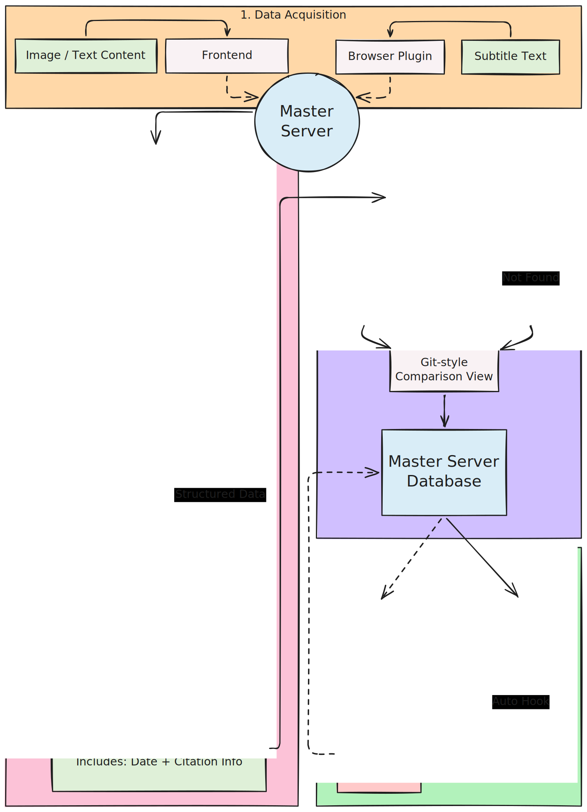

---
search:
  exclude: true
icon: lucide/rocket
---

# 获得开始

## 前言 (Overall Preface)

本站是一个个人词典网站，同时也是 <a href="https://github.com/gsjz/linkualog" target="_blank">这个仓库</a> 当前版本的官方演示站。

本页面待整理。


### 目标用户 (Target User)

本项目仍然主要在 Ubuntu 环境下开发，自然适配 macOS。Windows 用户更适合通过 WSL、虚拟机或者 Docker 运行后台服务。

具体来说，如果你满足以下条件：

- 希望利用现代技术手段，以一种更可持续的方式学习英语
- 有一台电脑、一台手机、可用的局域网环境，以及一定的 LLM API 预算
- 对命令行、`uv`、`npm`、静态站点部署有基本理解

本项目为你提供：

- 一个**浏览器插件 (browser-plugin)**，基于油猴类脚本环境，用于增强你在视频网站上的学习体验；
- 一个**主服务器 (master-server)**，后端基于 FastAPI，前端基于 React，用于接收 OCR 资源、维护词条 JSON（词条清洗、目录级 merge 建议、复习建议与打分回写），并承接浏览器插件发来的数据；
- 一个**静态网站 (static-website)**，提供了一个基于 Zensical 的静态网站实现案例，便于你在脱离主服务器也能随时浏览数据；
- 一个**示例数据集 (data)**，当前仓库内置 `daily`、`cet`、`ielts` 三个分类的数据。

### 当前模块状态 (Current Modules)

目前仓库里的主要模块关系如下：

- `browser-plugin/user/linkualog.user.js`：给最终用户安装的油猴脚本，当前覆盖 `youtube.com` 域名下的长视频与 Shorts；
- `browser-plugin/dev/`：浏览器插件的开发工程，基于 `Vite`、`React` 与 `vite-plugin-monkey`；
- `master-server/`：统一后的主应用，主前端中包含 `OCR 解析库`、`我的生词本`、`精修与复习` 三个标签页；
- `static-website/`：静态网站目录，通过 hook 把 `data/*/*.json` 转成 `docs/dictionary/**` 下的 Markdown；
- `data/`：当前主数据库样例，同时也是 `master-server` 与 `static-website` 默认共享的数据目录。

### 快速开始？(Quick Start?)

如果你只想用最短路径跑通当前版本，建议按下面的顺序：

1. 在仓库根目录根据 `.env.example` 准备 `.env`，通常只需要确认 `MASTER_SERVER_LLM_PROVIDER`、`MASTER_SERVER_LLM_MODEL`、`MASTER_SERVER_LLM_API_KEY`
2. 本地手动跑：进入 `master-server/`，执行 `uv sync` 和 `uv run main.py`
3. 或服务器 Docker 跑：在仓库根目录执行 `docker compose up -d --build master-server`
4. 打开主前端，在“全局配置”里确认模型与默认生词本目录
5. 安装 `browser-plugin/user/linkualog.user.js`
6. 把插件中的 `LAN Sync URL` 指向 `http://<你的主机>:8080/api/vocabulary/add`
7. 如果你还需要静态站，再进入 `static-website/` 运行 `make serve`

### 项目动机 (Motivation)

在这个项目之前，我个人维护着另一个英语学习知识库，部署在一个静态网站上。即使有 LLM 的帮助，以下重复性的工作流依然存在：

1. 将非文本数据转化为文本数据
2. 打开 LLM 网站，复制粘贴原始素材，并与模型对话
3. 创建或查找对应文件
4. 合并内容、打标签并添加引用

这些繁琐的步骤让学习效率未能达到我的预期。因此，我开发了这个系统，旨在让学习体验更加直观和可持续：

1. **专注力分离 (Focus Splitting)**：我希望能在很长一段时间内，完全脱离这套系统独立进行英语学习。之后，我再将学习素材集中发送给系统。系统将自动完成大部分繁杂的脏活累活。
2. **存储友好 (Storage Friendly)**：我不希望过多的非文本素材（其核心信息其实仅仅是文字）占用设备大量存储空间。因此，它们在处理后应该被直接清理丢弃。
3. **便于复习 (Review Friendly)**：我引入了一个 Agent 应用，来帮助我们对于数据进行复习、重构。

---

P.S. 'Link-ual' 听起来像 'lingual'（语言的）。系统的输出结果正是我们刚刚所学内容的 'lingual log'（语言日志）。

## 工作流 (Workflow)

### 概览 (Overview)

这张图反映的是旧版的大方向。当前模块边界已经更新，所以请以本文文字说明为准。



### 数据采集 (Data Acquisition)

本项目需要局域网 (LAN) 环境，这为数据传输提供了便利。例如，你可以将 PC 作为主服务器托管后端，用手机收集照片并从前端发送数据。

具体来说，我设计了两种主要的数据收集方式：

1. 你可以使用 `master-server` 主前端中的 `OCR 解析库` 标签页，将图片或 PDF 资源发送到服务器。这主要针对**图片素材**。（如果需要，你可以给任务命名，这有助于未来的引用和追溯。）
2. 你可以使用浏览器插件将视频网站上的字幕数据发送到服务器。这主要针对**视频素材**。（当前用户态脚本主要覆盖 YouTube 长视频与 Shorts，引用信息可以自动生成。）

补充一点：当前后端支持上传 PDF，分页依赖 Poppler。仓库里的 Docker 镜像已经安装 `poppler-utils`；如果你是本地手动运行，请自行确保系统里也有这一依赖。

### 数据处理 (Data Processing)

对于图片素材，系统会尝试对内容进行 OCR（光学字符识别），并默认提取关键词及其上下文。当前 OCR 会始终尝试返回下划线词坐标；为了获得更好的效果，此步骤仍然需要人工监督介入：

- 如果 OCR 识别内容较差，你可以尝试重新识别
- 如果 OCR 识别内容无误，你可以删除系统的推荐内容，或者自己手动选择句子和单词
- 系统会返回被标记词的坐标信息，供前端进行更精细的交互；如果模型对坐标不够确定，也可能只返回词条而不返回坐标

推荐算法方面：如果你在图片素材中标记了下划线，推荐内容会通过 OCR 与 LLM 联合生成；视频侧则会根据字幕和用户划词结果生成词条，并带上对应上下文。

接下来，这一步会把源素材转换为 JSON 格式。它们的命名通常是一个单词，或者是用 `-` 连接的短语，例如 `run.json`、`in-a-long-run.json`。

当前 JSON 结构除了 `word`、`definitions`、`examples` 之外，通常还会包含：

- `createdAt`
- `reviews`
- 例句中的 `source`
- 例句中的 `focusPositions`
- 来自视频素材时的 `youtube`
- 合并后的 `mergedFrom`（仅在部分精修流程中出现）

当前后端要求词条必须写入 `data/某个子目录/`，也就是说目录不能为空。保存时会先在目标目录中查找同名文件，以决定是进行合并还是创建新文件。

### 使用与部署 (Enjoy or Deploy)

当前主要有两种方式来消费这些产出结果：

1. **`master-server` 主前端**。其中的“我的生词本”和“精修与复习”直接围绕这些 JSON 文件工作。
2. **`static-website` 静态站**。JSON 文件可通过 hook 脚本转换为 Markdown，进而部署到 Zensical 静态网站上。

## 主服务器配置 (Master-server Set Up)

### 前言 (Preface)

当前的 `master-server` 是统一后的主应用：一套 FastAPI 后端，加一个 React 前端工程。基础环境管理涉及 `uv`、`npm`、Python 与 Node.js；如果你不具备这些基础知识，配置过程对你来说可能会有些挑战。

当前建议的环境基线是：

- Python `3.13`
- Node.js `20`
- `npm`
- `uv`

配置文件位置也已经固定：

- 仓库根目录 `.env`：默认配置，参考 `.env.example`
- `master-server/local_data/llm_config.json`：前端“全局配置”保存后的本地覆盖项

也就是说，`master-server` 虽然在自己的目录里运行，但它默认读取的是**仓库根目录**的 `.env`。

### 本地手动部署 (Local Manual Deploy)

这种方式适合你在自己的 Ubuntu / macOS 开发机上直接跑起来，方便调试。

1. 在仓库根目录准备 `.env`

通常只需要确认下面这几项：

- `MASTER_SERVER_LLM_PROVIDER`
- `MASTER_SERVER_LLM_MODEL`
- `MASTER_SERVER_LLM_API_KEY`
- 可选：`MASTER_SERVER_FRONTEND_PORT`
- 可选：`MASTER_SERVER_BACKEND_PORT`

高级 review / refine 调参已经不再放进 `.env.example`；通常直接在前端“全局配置”里改，或者看 `master-server/local_data/llm_config.json` 即可。

```bash
cd /path/to/linkualog
cp .env.example .env
# 编辑 .env
```

2. 进入 `master-server/` 目录运行

```bash
cd master-server
uv sync
uv run main.py
```

当前行为：

- `uv run main.py` 会启动统一 FastAPI 后端，默认端口是 `8080`
- 如果没有设置 `MASTER_SERVER_DISABLE_FRONTEND=1`，它还会拉起主前端开发服务
- 非 Docker 环境下，主前端默认端口是 `8000`
- 端口类配置可以在“全局配置”中修改，但需要重启服务后生效

启动后默认访问地址：

- 主前端：`http://localhost:8000`
- 后端 API：`http://localhost:8080`

如果你只想本地跑后端：

```bash
cd master-server
MASTER_SERVER_DISABLE_FRONTEND=1 uv run main.py
```

### 服务器 Docker 部署 (Server Docker Deploy)

这种方式适合轻量云服务器、家用小主机或 NAS。

1. 在仓库根目录准备 `.env`

必须至少确认：

- `MASTER_SERVER_LLM_PROVIDER`
- `MASTER_SERVER_LLM_MODEL`
- `MASTER_SERVER_LLM_API_KEY`

如果你的服务器在中国大陆或网络较慢，推荐保留默认镜像源；如果你有自己的源，也可以在 `.env` 里改：

- `MASTER_SERVER_APT_MIRROR_BASE`
- `MASTER_SERVER_PIP_INDEX_URL`
- `MASTER_SERVER_NPM_REGISTRY`

```bash
cd /path/to/linkualog
cp .env.example .env
# 编辑 .env
```

2. 构建并启动

```bash
cd /path/to/linkualog
docker compose up -d --build master-server
```

默认对外暴露：

- `http://服务器IP/`：主前端
- `http://服务器IP:8080/`：同一套后端 / API

常用运维命令：

```bash
docker compose logs -f master-server
docker compose up -d --build master-server
docker compose restart master-server
```

默认持久化目录：

- `./data`
- `./master-server/local_data`

如果你只改了前端，有时也可以只重建前端产物并替换 `dist`；但对多数使用者来说，直接 `docker compose up -d --build master-server` 最稳。

## 浏览器插件配置 (Browser-plugin Set Up)

### 前言 (Preface)

这是一个用于增强字幕体验的 GMonkey 浏览器插件。 

首先你需要了解什么是 GreaseMonkey（油猴），以及它与 TamperMonkey（篡改猴）的关系。我倾向于将这类浏览器插件统称为 GMonkey，就像它们提供的统一 API 前缀 'GM' 一样。 

当前仓库状态需要特别注意：

- 真正给最终用户安装的是 `browser-plugin/user/linkualog.user.js`
- 开发工程在 `browser-plugin/dev/`
- 当前用户态脚本覆盖 `youtube.com` 域名下的长视频与 Shorts
- 开发态代码里已经有 `YouTube`、`YouTube Shorts` 与 `LocalAdapter`
- `Bilibili` 相关适配还没有进入当前可用态

### 面向用户 (For User)

如果你只是想尝试这个插件，你**仅需**用到 `browser-plugin/user/linkualog.user.js` 这个文件。

在你的 TamperMonkey 中新建一个脚本，将该文件中的全部内容复制进去，然后保存 (`Ctrl + S`)。期间可能会提示要求授予一些权限。

推荐先打开插件设置，确认三组参数：

- `API URL / API Key / Model`：用于侧边栏里的流式 LLM 解释
- `LAN Sync URL`：默认是 `http://localhost:8080/api/vocabulary/add`；如果主服务器在局域网里的另一台机器上，请改成对应 IP
- `默认生词本目录 (Category)`：插件内部配置名是 `lan_action`，建议与 `master-server` 中的默认生词本目录保持一致

之后：

- 在 `youtube.com` 上打开带字幕的视频
- 等待侧边栏接收到字幕数据
- 用鼠标划词，或者从字幕列表中将单词和上下文加入队列
- 通过局域网接口把数据发送给主机端，以便进一步处理

### 面向开发者 (For Developer)

如果你想以开发者的视角了解本项目，可以查看 `browser-plugin/dev/` 目录。在你的终端中切换到该路径。

这部分是基于 `Vite`（`vite-plugin-monkey`）和 `React` 构建的。因此，和常规项目一样，使用 `npm install` 来生成（被 git 忽略的）`node_modules` 依赖文件夹。

然后你可以使用 `npm run dev` 来体验 HMR（模块热替换）。在装有 TamperMonkey 的浏览器中打开 localhost 链接，点击给出的 `install the plugin`（安装插件）按钮。如果你的网站没有任何反应，你可以尝试安装一个解除 CSP 限制的插件 (CSP-unblock plugin) 来绕过 CSP 策略。

如果你想自己重新打包构建产物，请使用 `npm run build`。
  
## 静态网站配置 (Static-website Set Up)

### 前言 (Preface)

相比于 `mkdocs`，`Zensical` 更为现代高效。它的主要原理是自动将 `.md` 文件转换成 Web 页面。

当前版本的 `static-website` 仍然需要在启动前先运行 hook，把 JSON 文件转换成 Markdown。

为了暂时替代这一步的自动化缺口，我继续使用 `Makefile` 绑定一些“快捷键”。当前仓库的实际状态是：

- `static-website/main.py` 仍然只是占位文件
- 真正的入口是 `Makefile` + `hooks/build_dict.py`
- `hooks/build_dict.py` 会读取 `DATA_DIR` 下的 JSON，并生成 `docs/dictionary/` 下的 Markdown
- `zensical.toml` 当前导航只预置了 `daily`、`cet`、`ielts` 三个目录；如果你新增分类，页面会生成，但导航需要手动补上

### 本地构建 (Local Build)

切换到 `static-website/` 作为工作目录。

```bash
uv sync
make serve
```

当前默认参数是：

- `PORT=6789`
- `DATA_DIR=../data`

如果你想显式覆写它们：

```bash
make serve PORT=6789 DATA_DIR=../data
```

其他常用命令：

- `make data`：只执行 JSON -> Markdown 转换
- `make build`：构建静态站点到 `static-website/site/`
- `make clean`：清理 `site/` 与 `docs/dictionary/`

### 服务器静态部署 (Server Static Deploy)

`static-website` 自身不是长期运行的动态服务，它更适合先构建、再把 `site/` 目录交给任意静态文件服务器。

一个常见流程是：

```bash
cd static-website
uv sync
make build DATA_DIR=../data
```

构建完成后：

- 生成结果位于 `static-website/site/`
- 你可以把整个 `site/` 目录交给 `Nginx`、`Caddy`、对象存储静态托管，或者任何能托管静态文件的服务
- 如果你的服务器上 `data/` 有更新，重新执行一次 `make build` 再覆盖原静态目录即可

如果你只是想在服务器上临时预览，也可以直接：

```bash
cd static-website
make serve PORT=6789 DATA_DIR=../data
```

### 通过 Github 部署 (Deploy by Github)

仓库当前仍然保留 `.github/workflows/deploy.yml`。它的实际行为是：

- 当 `main` 或 `master` 分支有新提交时触发
- 在 `static-website/` 下执行 `uv sync` 与 `make build`
- 将 `static-website/site/` 上传到 GitHub Pages
